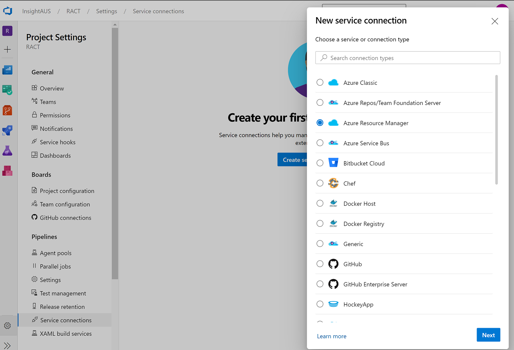
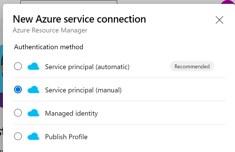
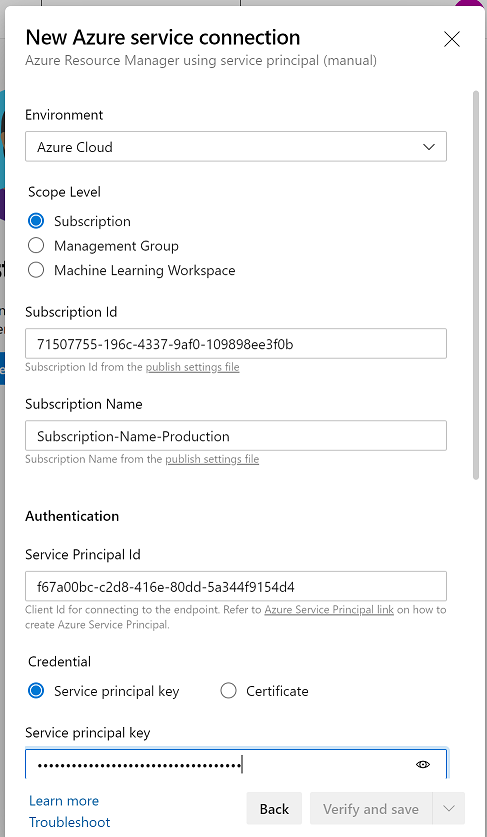

# Connecting Azure to Azure DevOps

## Creating the Azure Resources
The following resources are required to connect Azure to Azure DevOps
- Service Principal: Principal used by Azure DevOps for deployments
- Resource Group: Target for ARM template deployments
- AD Security Group: Used to manage principal role assignments
- Resource Group RBAC: Assigns a role to a group or principal

The script [resourceGroupSecurity.ps1](resourceGroupSecurity.ps1) creates:
- a Resource Group
- Service Principal
- Security Groups (Contributor and Reader) and,
- a Contributor Role Assignments for the Service Principal to the Resource Group

When the script is executed, output similar to the below is provided. Retain this information as it is needed in the next step
```
Subscription ID: 71507755-196c-4337-9af0-109898ee3f0b
Subscription Name: Subscription-Name-Production
Service Principal ID: f67a00bc-c2d8-416e-80dd-5a344f9154d4
Service Principal Key: ***********************************
Service Principal Key: 6c684930-c417-4e78-9d62-b61258e4b619
Service Connection Name: sp-azuredevops-prd-fuelsaver
```

**Note:** The script can be executed multiple times however the service principal key will be changed on each execution. To create a new resource group without refreshing the service principal, run with the `-skipSpCreate` flag.

## Azure DevOps Setup

1. Head to [Azure DevOps](https://dev.azure.com) and sign into your account
2. Within a project, navigate to the project setting (bottom left cog) and create a new service connection
<br/>
3. Select "Service principal (manual)
<br/>
4. Enter the script output
<br/>
## RACT Required Resource Groups

The following resource groups and service principals are required for the RACT Fuel Saver application:

```PowerShell
# RACT-Club-Non-Production
az account set --subscription "df1dd73e-6ea2-4b8f-b903-4752d3993662"
./resourceGroupSecurity -spName sp-azuredevops-npd-fuelsaver -rgName ract-aue-dev-arg-fuelsaver
./resourceGroupSecurity -spName sp-azuredevops-npd-fuelsaver -rgName ract-aue-uat-arg-fuelsaver -skipSpCreate
# RACT-Club-Production
az account set --subscription "4de5f092-bd1b-491e-9d1b-f91335825783"
./resourceGroupSecurity -spName sp-azuredevops-prd-fuelsaver -rgName ract-aue-prd-arg-fuelsaver
```

The above script will create the following:

Subscription | Service Principal | Resource Group | Security Group
---|---|---|---
RACT-Club-Non-Production | sp-azuredevops-npd-fuelsaver | ract-aue-dev-arg-fuelsaver | ract-aue-dev-arg-fuelsaver-contributor <br/>ract-aue-dev-arg-fuelsaver-reader
RACT-Club-Non-Production | sp-azuredevops-npd-fuelsaver | ract-aue-uat-arg-fuelsaver | ract-aue-uat-arg-fuelsaver-contributor <br/>ract-aue-uat-arg-fuelsaver-reader
RACT-Club-Production | sp-azuredevops-prd-fuelsaver | ract-aue-prd-arg-fuelsaver | ract-aue-prd-arg-fuelsaver-contributor <br/>ract-aue-prd-arg-fuelsaver-reader